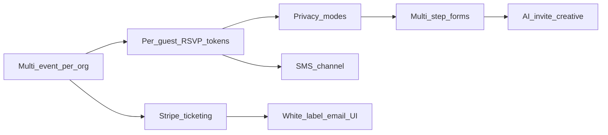

# Partiful killer — competitive map and roadmap

> Compiled: 2026-03-25  
> **Scope:** Product and engineering map for competing with Partiful (browser-first RSVPs, adult/professional positioning). **Not** an implementation spec — implement via [MASTER-PLAN.md](MASTER-PLAN.md) and linked docs.

## Summary

**Partiful** skews mobile-app RSVP, repetitive templates, visible social guest lists, simple payments (Venmo/PayPal links), and casual “house party” branding.

**AizuPass** should own **professional door operations** (offline-capable QR check-in, token-only payloads, org-scoped admin) and extend **up-stack** into invitation, privacy, paid ticketing, white-label, and integrations — without the forced app download or platform-cramped invite UX.

**Pitch (draft):** Partiful optimizes for unserious, hyper-social events; AizuPass is for adults and organizations that need **real tools** — private lists, serious registration, native payments, and check-in that works when the network does not.

---

## Stable identifiers (for agents and issue trackers)

Use these slugs when filing work; fold into [MASTER-PLAN.md](MASTER-PLAN.md) when execution starts.

| Epic ID | Intent |
|--------|--------|
| `tenancy-multi-event` | Multi-event per org; remove `UNIQUE(events.organization_id)`; clone/template MVP |
| `per-guest-rsvp-tokens` | Personal RSVP URLs (`/r/{token}`), bulk invite, revoke, rate limits |
| `privacy-modes` | `events.settings.privacy`; enforce on public RSVP + ingest + sync + future Zapier |
| `stripe-ticketing` | Ticket catalog + Checkout + webhook → attendee + QR email ([TICKETING-TYPES-PRICING-STRATEGY.md](TICKETING-TYPES-PRICING-STRATEGY.md)) |
| `white-label-tier` | Org email/RSVP branding; optional BYO sending domain |
| `sms-channel` | SMS delivery for invite/check-in links; compliance copy |
| `forms-strategy` | Hub-native multi-step vs Zapier-first; keep parity with [INTEGRATIONS-STRATEGY.md](INTEGRATIONS-STRATEGY.md) |
| `ai-hosted-pages` | Microsite kit (Path A) or first-party hosted pages + generated creative (Path B) |
| `master-plan-sync` | Concern audit + checklist rows for the above |

---

## Competitive wedge table

| Feature | Partiful limitation | AizuPass move |
|--------|---------------------|---------------|
| Guest access | Pushes app download for RSVP | **Zero-download browser RSVP**; add **unique per-guest links** (invitation tokens) |
| Design | Trending templates; samey layouts | **AI-generated** or highly customizable creative; escape template hell |
| Branding | Strong Partiful / playful UI | **White-label**; custom domains later; client-owned presentation |
| Privacy | Public / social-by-default feel | **Unlisted events**, invite-only gates, **no public guest list** on attendee surfaces; QR already token-only ([STEP-1-QR-SECURITY-PLAN.md](STEP-1-QR-SECURITY-PLAN.md)) |
| Data collection | Basic RSVP / limited questions | **Rich `source_data`**, CSV, **`POST /api/ingest/entry`**; multi-step / conditional (hub or external forms + Zapier) |
| Payments | Venmo / Cash App / PayPal links | **Native Stripe**; ticket types, inventory, professional checkout ([TICKETING-TYPES-PRICING-STRATEGY.md](TICKETING-TYPES-PRICING-STRATEGY.md)) |
| Recurring / power users | Weak cloning | **Clone events**, templates — **blocked until multi-event per org** |
| Delivery | Text-message centric | **Email + SMS**, host chooses channel; no forced “text blast” tone |

---

## Where AizuPass already wins (do not regress)

- **Browser-first registration:** Public `POST /api/attendees`, rate-limited; see codebase `src/pages/api/attendees.ts`, `RSVPForm`.
- **Door-grade ops:** Offline queue, atomic check-in, scanner UX — core moat vs. invite-only competitors.
- **Integrations hub:** CSV-first, server webhook, Eventbrite pull sync — see below.

---

## Integration surface (build on this, do not fork guestlist semantics)

Canonical detail: [INTEGRATIONS-STRATEGY.md](INTEGRATIONS-STRATEGY.md), [STEP-2-CENTRAL-HUB.md](STEP-2-CENTRAL-HUB.md).

**Implemented paths**

| Path | Role |
|------|------|
| CSV import | Primary for many organizers; column mapping → `source_data` |
| `POST /api/ingest/entry` | Server-to-server create/update; `micrositeEntryId` idempotency; optional QR + email |
| Eventbrite sync | `POST /api/integrations/eventbrite/sync`; see [EVENTBRITE-INTEGRATION.md](EVENTBRITE-INTEGRATION.md) |
| Public RSVP API | First-party form; must stay consistent with future **privacy modes** |
| Microsite pattern | [FORM-MICROSITE-SETUP.md](FORM-MICROSITE-SETUP.md) — optional landing + ingest |

**Planned / backlog**

- **Zapier / Make** — first-class parity with HTTP guestlist behavior ([MASTER-PLAN.md](MASTER-PLAN.md) §10).
- **Per-event webhook keys** — documented as Option B in STEP-2; tighten as usage grows.
- **OpenAPI-oriented docs** — same tier as Zapier for builders.

**Cross-cutting rules**

1. **Idempotency** on all new write paths (Stripe webhooks, invitation APIs) like ingest and Eventbrite `eb:{attendeeId}`.
2. **Privacy** applies to **every entry path**; document exceptions (e.g. trusted automation with bearer key) explicitly.
3. **Bursts** — ticketing/on-sales spikes; queue or backoff for email/QR side effects if needed.
4. **Clone / template** — copy `events.settings` (including integration config) safely when multi-event lands.

**Stripe vs Eventbrite:** For a given event, define whether Eventbrite is source of truth, one-time import, or disallowed when native Stripe ticketing is on — avoid double fulfillment.

---

## Engineering dependency: multi-event per organization

Today: **one event per organization** at the DB level (`UNIQUE(events.organization_id)` in `scripts/migrate-organizations.mjs`). See [README.md](../README.md), [MARKETING-HOMEPAGE-CONTENT-MAP.md](MARKETING-HOMEPAGE-CONTENT-MAP.md).

| Option | Idea |
|--------|------|
| **A (recommended)** | Multiple events per org; clone copies shell + settings + ticket types + form schema; guests optional |
| **B** | Single DB event + occurrences — heavier for reporting and check-in |

Unlocks cloning, recurring hosts, and cleaner parity with common ticketing mental models.

---

## Phased roadmap (dependencies)

1. **Foundations:** Multi-event + clone/template MVP; update [MASTER-PLAN.md](MASTER-PLAN.md) concern audit.
2. **Trust:** Per-guest tokens + privacy (unlisted, invite-only).
3. **Revenue:** Stripe ticketing phases per ticketing strategy doc.
4. **Agency:** White-label email + RSVP theming; public custom domain later.
5. **Automation:** SMS; multi-step forms **or** Zapier/Make parity (pick primary engineering focus).
6. **Differentiation:** Hosted / kit microsites + AI creative (Path A before Path B is reasonable).

### Wedges → epics (detail)

1. **Personalized browser RSVP** — `rsvp_tokens` table; `GET/POST` `/r/{token}`; organizer bulk + revoke; extend rate limits (`src/lib/rate-limit.ts`).
2. **AI / unique creative** — Path A: microsite kit + generated assets in `events.settings`; Path B: first-party `events.slug` public pages.
3. **White-label** — org-level email HTML, colors, logo; BYO domain for email; later Vercel-style mapping for public pages.
4. **Privacy** — `events.settings.privacy`: visibility, RSVP mode, admin approval; audit ingest + sync + future Zapier.
5. **Data collection** — short term: CSV + ingest + docs; medium term: hub form builder **or** double down on integrations.
6. **Ticketing** — Checkout → webhook → attendee + payment fields → existing QR email; separate SaaS billing from ticket Stripe account.
7. **Cloning** — after multi-event: duplicate event without guests by default; optional template library.
8. **SMS** — provider integration; tie to same invitation tokens; TCPA-aware defaults.

---

## Risks

- **Scope creep** — shipping AI, forms, Stripe, and white-label simultaneously fragments the story; follow the phase order.
- **Tenancy migration** — legacy orgs with multi-event backfill need careful migration (see migrate script comments).
- **Compliance** — SMS, payments, EU guests → legal review for enterprise-facing claims.

---

## Open questions / TODO

- [ ] Confirm **Option A vs B** for multi-event (recommend A in this doc).
- [ ] Decide **forms-strategy** primary: hub-native vs Zapier-first vs parallel with clear audience split.
- [ ] Define **Eventbrite vs Stripe** mutual exclusion or sync rules per event.
- [ ] Add checklist rows in [MASTER-PLAN.md](MASTER-PLAN.md) when implementation begins (`master-plan-sync`).
- [ ] Optional: short “vs Partiful” pointer in [PRODUCT-STRATEGY.md](PRODUCT-STRATEGY.md) linking here.

---

## References

| Doc | Use |
|-----|-----|
| [MASTER-PLAN.md](MASTER-PLAN.md) | Dev checklist and roadmap (source of truth for shipped work) |
| [PRODUCT-STRATEGY.md](PRODUCT-STRATEGY.md) | ICP, tiers, general positioning |
| [INTEGRATIONS-STRATEGY.md](INTEGRATIONS-STRATEGY.md) | CSV / API / automation principles |
| [TICKETING-TYPES-PRICING-STRATEGY.md](TICKETING-TYPES-PRICING-STRATEGY.md) | Stripe and ticket model |
| [STEP-2-CENTRAL-HUB.md](STEP-2-CENTRAL-HUB.md) | Hub architecture, ingest contract |
| [.cursor/plans/partiful-killer_roadmap_f7562ea3.plan.md](../.cursor/plans/partiful-killer_roadmap_f7562ea3.plan.md) | Long-form Cursor plan (if present in clone) |
