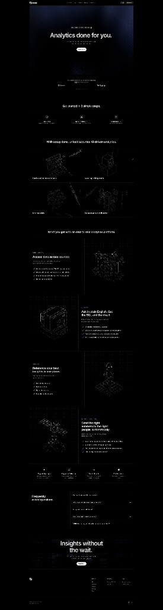

# Dark-mode analytics landing — structure & storytelling (reference)

> Compiled: 2026-03-27

## Summary

Full-page screenshot of a **long-form analytics product** homepage using a **dark, developer-tool** visual system: near-monochrome palette, **isometric wireframe illustrations**, subtle **grid** backgrounds, and **hero/footer bookends** with a soft blue glow. The **information architecture** closely matches the pattern documented for [Index.app](https://index.app/) in [INDEX-APP-MARKETING-REFERENCE.md](./INDEX-APP-MARKETING-REFERENCE.md) (promise → steps → unlock → grid → alternating pillars → integrations → FAQ → close)—this file focuses on **what changes when the same story is told in “dark precision” mode.**

## Visual reference

*File:* [analytics-landing-dark-mode-reference.png](./analytics-landing-dark-mode-reference.png)  
*Original capture:* `screencapture-index-app-2026-03-27` (workspace assets). **Verify branding** before citing the page publicly in marketing.

## Section flow (observed)

| # | Section | Story role |
|---|---------|------------|
| 1 | **Header** | Logo, Solutions / Pricing / Docs, Log in, **Book a demo** (primary nav CTA). |
| 2 | **Hero** | Headline **“Analytics done for you.”** Sub expands engineering/BI pain. Primary CTA **Book a demo.** Logo strip (enterprise / data ecosystem credibility). |
| 3 | **Three steps** | “Get started in 3 simple steps” — connect sources → define metrics → insights/reports (horizontal icons + labels). |
| 4 | **Unlock + 2×2 grid** | “With [product], unlock accurate AI-driven analytics” then four cells: raw data in, models, unstructured data, clean/accurate data — **technical depth** in skimmable tiles. |
| 5 | **Alternating pillars (Z-pattern)** | Four deep blocks: access across sources · plain English → SQL + chart · dashboards / one place · send numbers to the right people. Text + bullets; **wireframe art** alternates left/right. |
| 6 | **Integrations** | Row of tool logos (e.g. ads, analytics, commerce) — **where data comes from**. |
| 7 | **FAQ** | “Frequently asked questions” with accordion (+) — objections and procurement questions. |
| 8 | **Closing CTA** | **“Insights without the wait.”** + demo CTA — mirrors hero promise; **glow** ties to hero. |
| 9 | **Footer** | Product / Resources / Company columns. |

## Storytelling & design notes

1. **Single visual language.** Line-art isometrics + dotted/square grid = **structured data** and **precision** without stock photography. The story is “complex stack, simple surface.”

2. **Dark canvas = focus.** High contrast (white on black) and generous negative space make each band feel like a **single beat**—similar rhythm to color-blocked light pages, achieved with **typography scale** and **illustration** instead of hue changes.

3. **Same arc as light B2B analytics pages.** Hero outcome → reduce fear (steps) → **unlock** framing → outcome/grid → proof pillars → integrations → FAQ → repeated headline for closure. See comparison in [INDEX-APP-MARKETING-REFERENCE.md](./INDEX-APP-MARKETING-REFERENCE.md).

4. **Bookend glow.** Hero and final CTA share **ambient blue** treatment so the scroll feels **closed**—the visitor returns to the same emotional temperature at purchase time.

5. **FAQ placement.** Late in the funnel, after capability proof—good for **security, fit, and setup** questions.

## When to use this pattern (for our marketing)

- If the site targets **operators and technical buyers** who already live in dark UIs (dashboards, terminals), this **tone** can read as “built for your world.”
- If the brand is **event-day calm and human** (queues, staff, venues), a **full black** page may feel cold—borrow **sections** (steps, unlock, Z-pattern) while keeping a **lighter** palette aligned with [MARKETING-HOMEPAGE-PRINCIPLES.md](../MARKETING-HOMEPAGE-PRINCIPLES.md).

## Related references

- [INDEX-APP-MARKETING-REFERENCE.md](./INDEX-APP-MARKETING-REFERENCE.md) — light UI, same IA family (demo, setup, unlock, pillars).
- [LANDING-PAGE-NARRATIVE-FLOW.md](./LANDING-PAGE-NARRATIVE-FLOW.md) — chapter-color / lifestyle long scroll (different mood, same progressive disclosure idea).
