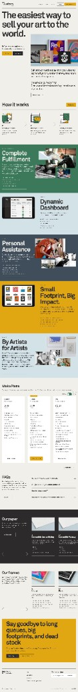

# Case for a narrative, section-blocked landing page

> Compiled: 2026-03-27

## Summary

This document argues for a **long-form, story-driven homepage** structured as **distinct full-width chapters** (hero → how it works → alternating value blocks → pricing/FAQs → product proof → final CTA → footer). It is anchored to a **visual reference** (see below) from a mature B2C service that sells a complex promise—quality, logistics, and trust—in a single scroll. The pattern transfers to B2B SaaS for organizers: **clarity of sequence beats cleverness of layout.**

## Visual reference

Full-page screenshot preserved for layout, rhythm, and section ordering (not for copy or brand):

*File:* [landing-page-story-reference.png](./landing-page-story-reference.png)

## Why this flow works

1. **Progressive disclosure.** The visitor is not asked to understand the whole product in the hero. The hero states the outcome and emotional hook; the rest of the page earns detail step by step.

2. **Rhythm and orientation.** Alternating background colors and generous vertical space create **natural pause points**. Each block reads as “one idea,” which improves scanning and recall compared to a uniform white page.

3. **Trust before transaction.** Social proof appears early (quote under the hero). Deeper reassurance (operations, product quality, support) arrives in the body **before** pricing, so price is evaluated in context.

4. **“How it works” as a bridge.** A simple three-step strip answers “is this complicated?” immediately after the hero. It reduces anxiety and sets up the longer feature narrative.

5. **Feature blocks as chapters, not lists.** Each major block combines headline, short paragraph, bullets, and **evidence** (photo, UI, lifestyle). That pairing—claim plus proof—mirrors how buyers actually decide.

6. **Pricing and FAQ as objection handling.** Placing plans and FAQs **after** the story means visitors arrive with questions already partially answered; the table and accordion finish the job.

7. **Carousels as depth, not distraction.** Late-page horizontal carousels (materials, variants) work as **optional depth** for engaged readers without bloating the core narrative.

8. **Repeated CTA with consistent accent color.** A single strong accent (e.g. mustard on neutrals) trains the eye: “this is the action.” Final CTA block echoes the hero promise for closure.

## Section map (reference page)

| Order | Section | Role in the story |
|-------|---------|-------------------|
| 1 | Hero + nav | Outcome headline, subtext, primary/secondary CTAs, hero visual, early testimonial |
| 2 | How it works (3 steps) | Reduce perceived complexity; set expectations |
| 3–7 | Alternating feature blocks | Each: one value prop + copy + imagery (fulfillment, product UI, support, values, community, etc.) |
| 8 | Pricing + FAQ | Commercial decision + friction removal |
| 9 | Product/detail carousels | Spec-level proof for those still comparing |
| 10 | Final CTA band | Punchy summary line + single CTA |
| 11 | Footer | Legal, social, newsletter |

## Structure & storytelling notes (reference page)

*Expanded from a full-page read of [landing-page-story-reference.png](./landing-page-story-reference.png).*

### Macro-structure (the arc)

The scroll follows a **conversion arc**, not a flat feature dump:

1. **Value proposition** — Who it’s for, outcome, first visual of the end state (prints in a gallery-like frame).
2. **Process** — Three steps turn a scary backend (fulfillment) into a short journey.
3. **Feature chapters** — Each band is one thesis (fulfillment, dashboard, humans, sustainability, community); imagery swaps to match.
4. **Commercial layer** — Plans make “joining” concrete; FAQs reduce fear.
5. **Spec depth** — Paper and frames carousels answer “will it feel cheap?” for skeptics who scrolled this far.
6. **Close** — A **pain-led** headline (“Say goodbye to…”) reframes the product as relief, then one CTA.

### Layout mechanics

- **Z-pattern / alternating rows.** Feature blocks swap **image left vs right** and shift background color band to band. That keeps long scrolls from feeling like one endless column and nudges the eye in a predictable path.
- **Color as navigation.** Distinct bands (e.g. forest green, light blue, slate, mustard) act like **chapter markers**: you can skim by hue and still sense “we moved to a new argument.”
- **Accent color = action.** Yellow appears on primary nav CTA and again on key bands; the eye learns where to click without re-reading.

### Storytelling devices

- **Hero = outcome + product shot.** Headline sells the dream (“easiest way to sell… to the world”); photography proves **tangible output** (prints), not abstract software.
- **How it works = anxiety reduction.** Steps are **Connect → Sell → Ship** (integration, purchase, hands-off logistics). It reframes “complicated operations” as three named beats.
- **Claims paired with proof type.** Fulfillment block uses **process** photos; dashboard uses **UI** on a tablet; support uses **people**; sustainability/community use **values** imagery. The *kind* of evidence matches the claim.
- **Pricing = story handoff.** Copy moves from “what we do” to “how you can start,” with a **recommended** tier called out so decision-fatigued visitors have a default.
- **FAQs + spec carousels = objections last.** Accordion handles doubts; darker “Our paper / Our frames” sections feel **craft and quality**, reassuring that automation ≠ cheap output.
- **Final CTA = problem/solution.** Closing line names **pains** (queues, footprint, dead stock) so the signup feels like shedding weight, not adding another tool.

### Typography and skim behavior

- **Oversized headlines** carry the narrative: a fast scroller can grasp the whole pitch from **big type alone**; body copy is for readers who linger.

### Takeaway for our marketing site

Reuse the **pattern** (arc, alternating proof types, chapter colors, pain-led close). Replace the **nouns** (art prints → events, door lines, check-in accuracy) using [MARKETING-HOMEPAGE-CONTENT-MAP.md](../MARKETING-HOMEPAGE-CONTENT-MAP.md).

## How to adapt for this product (QR Check-In)

The **sequence** is the asset: hero (door speed, reliability) → **how it works** (create event → import or integrate → scan) → **blocks** mapped to real differentiators (offline queue, token-based QR, staff workflow, integrations) → **pricing/FAQ** aligned with [TICKETING-TYPES-PRICING-STRATEGY.md](../TICKETING-TYPES-PRICING-STRATEGY.md) and honest status in [MASTER-PLAN.md](../MASTER-PLAN.md) → **proof** (screenshots, short clips) → **closing CTA**.

Typography and palette should follow [MARKETING-HOMEPAGE-PRINCIPLES.md](../MARKETING-HOMEPAGE-PRINCIPLES.md); section-level copy ideas live in [MARKETING-HOMEPAGE-CONTENT-MAP.md](../MARKETING-HOMEPAGE-CONTENT-MAP.md).

## Open questions / TODO

- [ ] Replace reference screenshot with an in-house wireframe or branded mock when design starts.
- [ ] Decide ICP order for feature blocks (e.g. venue vs corporate vs community) and validate against analytics once live.

## References

- [MARKETING-HOMEPAGE-CONTENT-MAP.md](../MARKETING-HOMEPAGE-CONTENT-MAP.md) — section-to-capability mapping
- [MARKETING-HOMEPAGE-PRINCIPLES.md](../MARKETING-HOMEPAGE-PRINCIPLES.md) — homepage messaging principles
- [PRODUCT-STRATEGY.md](../PRODUCT-STRATEGY.md) — positioning context
