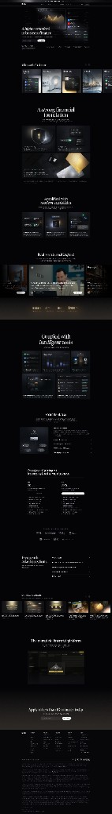

# Slash — landing page structure & storytelling (reference)

> Compiled: 2026-03-27  
> Source: [slash.com](https://www.slash.com/) (referrer in original link: `?ref=minimal.gallery`)

## Summary

[Slash](https://www.slash.com/) uses a **premium fintech** narrative: **aspiration in the hero** (serif headline + real product UI), then **tactile luxury** (cards + UI teasers), **foundation and scale** (trust, infrastructure), **capability grids**, **human social proof**, **quantitative proof**, **ecosystem depth**, **security**, **pricing as a chapter** (not a bolt-on page), **partner bar + FAQ**, and a **final dashboard hero** that mirrors the opening—**symmetric storytelling** with a strong close. The page earns trust for a regulated, high-stakes category without feeling like a compliance PDF.

## Visual reference

*File:* [slash-landing-reference.png](./slash-landing-reference.png)

## Why the storytelling works

1. **Hero = product, not metaphor.** A large, sharp **dashboard mockup** immediately answers “what is this?” Luxury is in **craft** (typography, gold accent, glass UI), not vague stock photos.

2. **“Next standard” bridge.** After the hero, a **card row** mixes **physical cards** and **UI chrome**—the story is *tangible product + software* in one beat.

3. **Foundation before features.** “Strong financial foundation” (shield, scale, cards) moves from **surface** to **why it’s safe to build on**—critical for money products; same *infrastructure-after-promise* logic applies to any “bet the event on this” tool.

4. **Capability grid with three lenses.** Multi-card / mobile / controls = **breadth without a feature list**—each tile is a **use story**.

5. **Humans before numbers, numbers before fine print.** Testimonials with **cinematic faces** build empathy; a **slim stats bar** adds scale; both precede the dense ecosystem mosaic.

6. **Ecosystem mosaic = depth for buyers who need it.** A collage of real UI proves **serious product** without one endless screenshot.

7. **Security section = Face ID + checklist.** Pairs **device-native trust** with **policy-style bullets**—standard for fintech, adaptable as “offline / token / roles” for check-in.

8. **Pricing in the scroll.** Standard vs Premium **as part of the story**, not a separate trap door—reduces “where do I even start?”

9. **Closing mirrors opening.** “Ultimate financial platform” + **dashboard hero again** + **time-bound CTA** (“Apply in less than 10 minutes”) + email field = **confidence loop**.

10. **Footer legal without stealing the show.** Dense disclosure **low contrast**—required gravity without breaking the premium rhythm above.

## Section map (observed)

| Order | Section | Role |
|-------|---------|------|
| 1 | Nav + hero | Serif headline, dashboard mockup, **Open Account** |
| 2 | “The next standard” | Horizontal cards: product + UI + cards |
| 3 | Strong foundation | Trust, scale, FDIC-adjacent visual language |
| 4 | “Simplified with modern capabilities” | 3-up: multi-card, mobile, controls |
| 5 | “Real emotional support” | Testimonial carousel (video/stills) |
| 6 | Stats bar | Billions / years / etc. |
| 7 | “Coupled with intelligent tools” | Mosaic of UI surfaces |
| 8 | “Security by design” | Phone + biometrics + feature list |
| 9 | Account types / pricing | Two columns, **Apply** |
| 10 | Partner logos + FAQ | Trust bar, accordion |
| 11 | Final CTA | Headline + dashboard + email + **Get started** |
| 12 | Footer | Sitemap + legal block |

## Design system (for briefs)

- **Type:** Serif **headlines** + geometric **sans** body → “luxury tech.”
- **Color:** True black base, **gold** highlights, white primary text.
- **Imagery:** Glassmorphism in UI, **high-fidelity** mocks, **physical** cards where relevant.
- **Space:** Generous vertical rhythm—each section reads as one **deliberate** chapter.

## Adaptation for QR Check-In

- **Hero with real UI** (scanner, door list, or admin) matches our “show the thing” principle in [MARKETING-HOMEPAGE-CONTENT-MAP.md](../MARKETING-HOMEPAGE-CONTENT-MAP.md).
- **Foundation → capabilities → human proof → stats (when honest)** maps to: reliability/offline → workflows → organizer quotes → usage or events checked (if we have numbers).
- **Pricing in-flow** only if it matches our packaging docs; otherwise keep the **chapter** idea but link to a dedicated page per [TICKETING-TYPES-PRICING-STRATEGY.md](../TICKETING-TYPES-PRICING-STRATEGY.md).
- **Tone:** Events skew **human and calm**, not bank-luxury—borrow **structure**, not necessarily black/gold unless brand goes there.

## Related references

- [ANALYTICS-LANDING-DARK-MODE-REFERENCE.md](./ANALYTICS-LANDING-DARK-MODE-REFERENCE.md) — dark dev-tool aesthetic, different category.
- [LANDING-PAGE-NARRATIVE-FLOW.md](./LANDING-PAGE-NARRATIVE-FLOW.md) — color-block lifestyle story, different mood.
